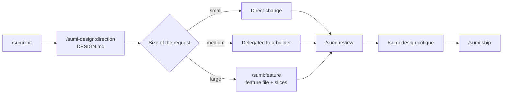

<div align="center">

<a href="https://sumitsubo-docs.vercel.app/en"></a>

# Sumitsubo 墨壺

**Mark the line before you cut.**<br>
A Claude Code framework for web design and development: direction first, then the work.

[](.claude-plugin/marketplace.json)
[](LICENSE)
[](#whats-inside)
[](https://sumitsubo-docs.vercel.app/en)

[**Documentation**](https://sumitsubo-docs.vercel.app/en) · [Reference](https://sumitsubo-docs.vercel.app/en/reference) · [Documentación en español](https://sumitsubo-docs.vercel.app) · [Guía en español](docs/GUIA.md)

</div>

---

A *sumitsubo* is the Japanese carpenter's ink line: it snaps the true line onto the wood before any cut is made. This framework does the same for AI-assisted web work. It encodes how a senior design engineer works — process that scales with the request, code without slop, accessibility and performance as acceptance criteria — and, above all, **design that doesn't look like every other AI-generated site**.

Short name and command prefix: **`sumi`** (墨, ink).

## Quick start

```bash
# in Claude Code
/plugin marketplace add kurodaSensei/sumitsubo
/plugin install sumi-design@sumitsubo     # core + design + all companions
/plugin install sumi-nuxt@sumitsubo       # plus the stack pack(s) you use
```

Then, in a project:

```text
/sumi:init                  set up .sumi/, the managed CLAUDE.md block and the model profile
/sumi-design:direction      brief → three divergent directions → DESIGN.md
/sumi:feature <idea>        plan large work in one feature file
/sumi:review                review the current slice with context-free lenses
/sumi:ship                  final gate and PR draft
/sumi:doctor                read-only check of the install and this project
```

## How it works



- **Direction before pixels.** A brief with brand tensions, explicit anti-references, three directions that differ on at least five axes, and a `DESIGN.md` whose contrast is verified by script. A cross-project **design ledger** keeps you from repeating fonts, palettes and layouts across clients.
- **Process proportional to the request.** Small things get done directly; large work gets one organic feature file with acceptance criteria and evidence. A **scope check** stops and asks *Minimal or Extended?* when a plan outgrows what you asked for.
- **Small houses, not Eiffel towers.** About 400 changed lines per slice. Deliberate simplifications are marked with `ponytail:` comments that say when to extend them.
- **Fresh eyes, on a budget.** Reviews run as subagents that see a frozen diff and the check results, never the author's reasoning. At most three lenses per review, each with a hard tool budget.

## Model routing

Opus only where it changes the outcome:

| Role | Model (`balanced`) | Does |
|---|---|---|
| `scout` | Haiku | Finds files, reads versions and docs, summarizes |
| `builder` | Sonnet | Implements briefed tasks and slices, runs checks |
| `architect` | Opus | Architecture, data models, migrations, slicing, trade-offs |
| Review lenses | Sonnet · Opus for high-risk security | Context-free reviews |
| Session | `opusplan` | Opus while planning, Sonnet while executing |

Switch per project with `/sumi:models balanced | economy | performance`. → [Model routing reference](https://sumitsubo-docs.vercel.app/en/skills/sumi/model-routing)

## What's inside

| Plugin | | What it gives you |
|---|---|---|
| [`sumi`](https://sumitsubo-docs.vercel.app/en/skills/sumi/workflow) | core | Adaptive workflow, scope check, line budgets, risk gates, budgeted receipt-based reviews, model routing, standards for HTML, CSS, JS/TS, accessibility (WCAG 2.2 AA) and performance (Core Web Vitals), git and secret guard hooks |
| [`sumi-design`](https://sumitsubo-docs.vercel.app/en/skills/sumi-design/design-direction) | core | Creative direction, anti-slop catalog, design ledger, `DESIGN.md` tokens with contrast checker, motion rules, design lens, Claude Design bridge |
| [`sumi-nuxt`](https://sumitsubo-docs.vercel.app/en/skills/sumi-nuxt/nuxt-architecture) | stack | Nuxt 4, Vue 3.5, Firebase/Firestore, Tailwind v4 |
| [`sumi-react`](https://sumitsubo-docs.vercel.app/en/skills/sumi-react/next-app-router) | stack | React 19, Next.js App Router, caching, Server Actions, testing |
| [`sumi-shopify`](https://sumitsubo-docs.vercel.app/en/skills/sumi-shopify/shopify-liquid) | stack | Online Store 2.0 themes: Liquid, sections and blocks, storefront JS, e-commerce accessibility |
| [`sumi-wordpress`](https://sumitsubo-docs.vercel.app/en/skills/sumi-wordpress/wp-block-theme) | stack | Native block themes with no build step: `theme.json` design system, dynamic blocks, core APIs over plugins, token audit |

<details>
<summary><strong>All commands</strong></summary>

| Command | Purpose |
|---|---|
| [`/sumi:init`](https://sumitsubo-docs.vercel.app/en/commands/sumi/init) | Detect the stack, create `.sumi/`, write the managed `CLAUDE.md` block, set the model profile |
| [`/sumi:feature`](https://sumitsubo-docs.vercel.app/en/commands/sumi/feature) | Explore, check scope, refute uncertainty and write the feature file |
| [`/sumi:review`](https://sumitsubo-docs.vercel.app/en/commands/sumi/review) | Budgeted review of the current slice; `--quick` for small changes |
| [`/sumi:ship`](https://sumitsubo-docs.vercel.app/en/commands/sumi/ship) | Checks, evidence, deliberate simplifications and the PR draft |
| [`/sumi:models`](https://sumitsubo-docs.vercel.app/en/commands/sumi/models) | Show or switch the model profile and session model |
| [`/sumi:sync`](https://sumitsubo-docs.vercel.app/en/commands/sumi/sync) | Update the managed `CLAUDE.md` block and config to the installed version |
| [`/sumi:doctor`](https://sumitsubo-docs.vercel.app/en/commands/sumi/doctor) | Read-only: marketplace source, version drift, companions, project config |
| [`/sumi-design:direction`](https://sumitsubo-docs.vercel.app/en/commands/sumi-design/direction) | The full creative-direction process |
| [`/sumi-design:critique`](https://sumitsubo-docs.vercel.app/en/commands/sumi-design/critique) | Critique screens against `DESIGN.md` and the anti-slop catalog |
| [`/sumi-design:deps`](https://sumitsubo-docs.vercel.app/en/commands/sumi-design/deps) | Verify companions and find leftover duplicates |

</details>

## Companions

Installing `sumi` and `sumi-design` also installs curated pieces of **Impeccable**, **Ponytail**, **Taste**, **Emil Kowalski's skills** and **Superpowers** as dependencies. They are referenced from their upstream repositories, never copied, so they keep their licenses and update from their authors. Sumitsubo decides when each one runs; the full install adds about 6k tokens of always-on context. See [THIRD-PARTY.md](THIRD-PARTY.md).

## Principles

1. **Process must be justified.** Help the user decide; don't use every capability by default.
2. **Small houses, not Eiffel towers.** The best solution within the budget.
3. **Done means verified.** Tests run, axe results, Lighthouse numbers, screenshots.
4. **Fresh eyes.** Reviewers never see the author's reasoning.
5. **Nothing visual by default.** Every font, color, radius and animation traces back to `DESIGN.md`.
6. **Deterministic where possible.** Hooks and scripts handle what should never depend on a model's mood.

## Repository layout

```text
.claude-plugin/marketplace.json     6 plugins + 15 upstream companions
plugins/<plugin>/
  .claude-plugin/plugin.json
  skills/<skill>/SKILL.md           (+ references/, scripts/)
  agents/  commands/  hooks/  templates/
scripts/validate.mjs
docs/GUIA.md                        Spanish guide
docs/ARCHITECTURE.md                layers, project state, roadmap
```

## Development

```bash
node scripts/validate.mjs                    # structure, frontmatter, references
node scripts/check-companions.mjs            # do the 15 companions still resolve upstream?
claude plugin validate .                     # official marketplace validation
claude plugin validate --strict plugins/sumi
```

Both scripts run in CI: `validate.mjs` on every push, `check-companions.mjs` on
pull requests and weekly on a schedule. The schedule is the point — the
companions live in repositories this project does not control, so an author
renaming a folder breaks `/plugin install` for everyone on a day nobody here
pushed anything.

The [documentation site](https://sumitsubo-docs.vercel.app/en) ([source](https://github.com/kurodaSensei/sumitsubo-docs)) renders its reference pages from this repository; re-sync it after changing skills or commands.

## Credits

Concepts inspired by Gentle AI (Gentleman Programming). Companions are independent projects with their own licenses. Sumitsubo is [MIT](LICENSE) licensed, by [Alfredo Romero](https://github.com/kurodaSensei).
